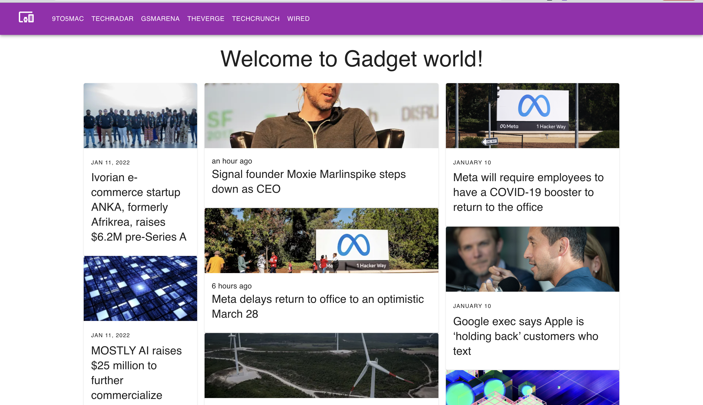

## Gadget-News
[Demo link](https://gadget-news.netlify.app/)

##### It is fully functional website and showing real data about last minute Gadget news updates and news from `RapidApi` 
Gadget News is where tomorrow is realized. It is the essential source of information and ideas that make sense of a world in constant transformation. The Gadget News conversation illuminates how technology is changing every aspect of our lives—from culture to business, science to design. The breakthroughs and innovations that we uncover lead to new ways of thinking, new connections, and new industrie.

### Stacks
`React.js`, `React-Router`, `React-Query`, `Material UI`, `React-icons`, `Axios` and `Vite.js`.
